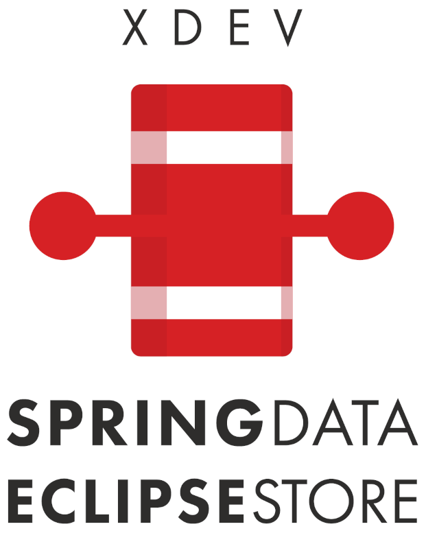

[](https://mvnrepository.com/artifact/software.xdev/spring-data-eclipse-store)
[](https://github.com/xdev-software/spring-data-eclipse-store/actions/workflows/checkBuild.yml?query=branch%3Adevelop)
[](https://sonarcloud.io/dashboard?id=xdev-software_spring-data-eclipse-store)

<div align="center">
    
</div>

# spring-data-eclipse-store

A library to simplify using [EclipseStore](https://eclipsestore.io/) in the [Spring environment](https://spring.io/projects/spring-data/).

What makes this library special is, that it creates a working copy of the data.
This way EclipseStore behaves almost exactly like relational database from a coding perspective.

## Features

The library provides following features:

* Enforces the
  **[Spring data repository concept](https://docs.spring.io/spring-data/jpa/reference/repositories/core-concepts.html)**
  for EclipseStore by using [working copies](#working-copies)
* **[Drop in compatible](#usage)** for your existing Spring application
* Utilizes **ultra-fast EclipseStore serializing and storing**
* Enables your application to **select
  any [EclipseStore target](https://docs.eclipsestore.io/manual/storage/storage-targets/index.html)** (e.g.
  [PostgreSQL](https://docs.eclipsestore.io/manual/storage/storage-targets/sql-databases/postgresql.html),
  [AWS S3](https://docs.eclipsestore.io/manual/storage/storage-targets/blob-stores/aws-s3.html) or
  [IBM COS](https://github.com/xdev-software/eclipse-store-afs-ibm-cos))
* Can save up to **99%[^1] of monthly costs** in the IBM Cloud and up to 82%[^2] in the AWS Cloud

[^1]:If the COS Connector is used in the IBM Cloud instead of a PostgreSQL and approx. 10,000 entries with a total size
of 1
GB of data are stored. ([IBM Cloud Pricing](https://cloud.ibm.com/estimator/estimates), as of 08.01.2024)

[^2]: If the S3 connector is used instead of DynamoDB under the same conditions at
AWS. ([AWS Pricing Calculator](https://calculator.aws/#/estimate?id=ab85cddf77f0d1aa0457111ed82785dfb836b1d8), as of
08.01.2024)

### Working copies

If you use EclipseStore without our library, EclipseStore loads the data from the datastore directly into memory. You make your changes on these loaded Java objects and by calling ``store`` EclipseStore writes it directly from memory to the datastore.


If you e.g. change the address of a person, the changed address is already in your data model, **even before storing** this person.
This is very different from the behavior a Spring user expects.

With *Spring-Data-Eclipse-Store* every time an object is loaded from the datastore, a working copy of that object (or rather the object tree) is created and returned to the user. Therefore, the user can make the changes on the working copy without any changes to the actual data model. The changes are only persisted after calling ``save`` on a repository.


## Installation
[Installation guide for the latest release](https://github.com/xdev-software/spring-data-eclipse-store/releases/latest#Installation)

### Prerequisites

|              | Minimal Version |
|--------------|-----------------|
| Java         | ``17``          |
| Spring Data  | ``3.2.2``       |
| EclipseStore | ``1.1.0``       |

### Usage

After adding the library in your dependencies, using it is as easy as adding the ``@EnableEclipseStoreRepositories`` annotation to your ``@SpringBootApplication`` annotation.

## Demo

To see how easy it is to implement EclipseStore in your Spring project, take a look at the two
[demos](./spring-data-eclipse-store-demo):<br/>
A [simple](./spring-data-eclipse-store-demo/src/main/java/software/xdev/spring/data/eclipse/store/demo/simple)
and a
more [complex demo](./spring-data-eclipse-store-demo/src/main/java/software/xdev/spring/data/eclipse/store/demo/complex).

> [!NOTE]  
> Since the library is using reflection to copy data, the following JVM-Arguments may have to be set:
> ```
> --add-opens=java.base/java.util=ALL-UNNAMED
> --add-exports java.base/jdk.internal.misc=ALL-UNNAMED
> --add-opens=java.base/java.lang=ALL-UNNAMED
> --add-opens=java.base/java.time=ALL-UNNAMED 
> ```


## Support

If you need support as soon as possible, and you can't wait for any pull request, feel free to
use [our support](https://xdev.software/en/services/support).

## Contributing
See the [contributing guide](./CONTRIBUTING.md) for detailed instructions on how to get started with our project.

## Dependencies and Licenses
View the [license of the current project](LICENSE) or the [summary including all dependencies](https://xdev-software.github.io/spring-data-eclipse-store/dependencies/)
